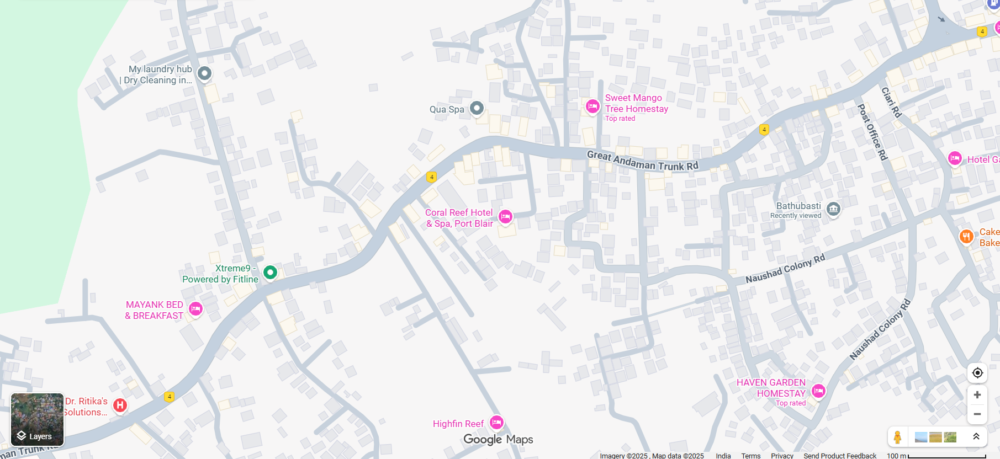
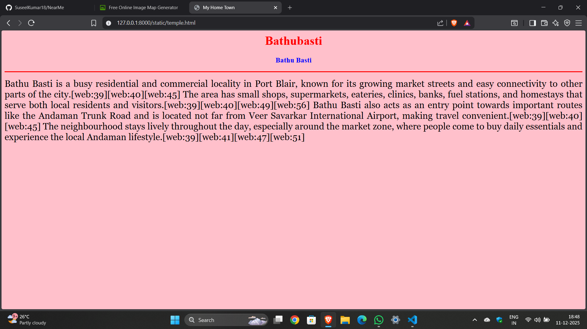
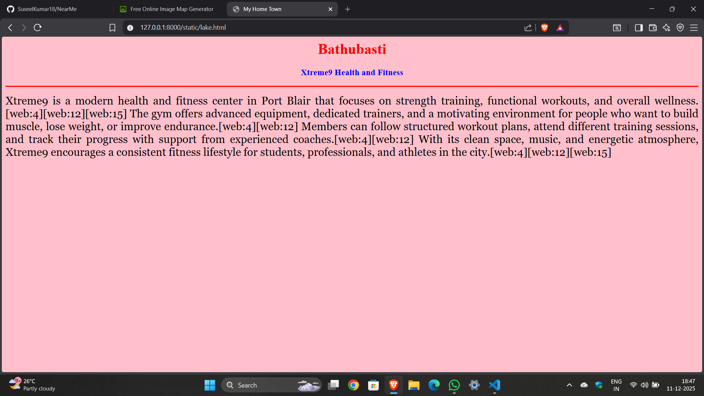

# Ex04 Places Around Me
## Date: 10.12.2025

## AIM
To develop a website to display details about the places around my house.

## DESIGN STEPS

### STEP 1
Create a Django admin interface.

### STEP 2
Download your city map from Google.

### STEP 3
Using ```<map>``` tag name the map.

### STEP 4
Create clickable regions in the image using ```<area>``` tag.

### STEP 5
Write HTML programs for all the regions identified.

### STEP 6
Execute the programs and publish them.

## CODE
```
map.html

<html>
<head>
    <title>My City</title>
</head>
<body>
    <h1 align="center">
        <font color="red"><b>Bathubasti</b></font>
    </h1>

    <h3 align="center">
        <font color="blue"><b>S Suseel kumar (25019175)</b></font>
    </h3>

    <center>
        

<map name="image-map">
    <area target="" alt="Qua Spa" title="Qua Spa" href="home.html" coords="727,177,893,224" shape="rect">
    <area target="" alt="Bathubasti" title="Bathubasti" href="temple.html" coords="1384,340,1531,422" shape="rect">
    <area target="" alt="Xtreme9" title="Xtreme9" href="lake.html" coords="312,457,535,544" shape="rect">
    <area target="" alt="Highfin Reef" title="Highfin Reef" href="garden.html" coords="751,731,938,796" shape="rect">
</map>
    </center>
</body>
</html>

home.html

<html>
<head>
    <title>My Home Town</title>
</head>
<body bgcolor="pink">
    <h1 align="center">
        <font color="red"><b>Bathubasti</b></font>
    </h1>

    <h3 align="center">
        <font color="blue"><b>Qua Spa</b></font>
    </h3>

    <hr size="3" color="red">

    <p align="justify">
        <font face="Georgia" size="5">
            Qua Spa is a luxury spa in Port Blair known for its peaceful ambience and relaxing treatments that help visitors unwind from daily stress.[web:22][web:26][web:29][web:35] 
            The spa offers services such as body massages, exfoliation, skin treatments, and brightening facials using professional techniques and quality products.[web:24][web:25][web:31][web:33] 
            Guests can choose from therapies like Balinese or Swedish massages and enjoy a calm, well-designed space that promotes both physical and mental relaxation.[web:25][web:31][web:33][web:36] 
            Located near Mega Engineering in Garacharama, Qua Spa has become a popular wellness spot for locals and tourists seeking a premium self-care experience in Port Blair.[web:23][web:24][web:34][web:38] 
        </font>
    </p>
</body>
</html>

lake.html

<html>
<head>
    <title>My Home Town</title>
</head>
<body bgcolor="pink">
    <h1 align="center">
        <font color="red"><b>Bathubasti</b></font>
    </h1>

    <h3 align="center">
        <font color="blue"><b>Xtreme9 Health and Fitness</b></font>
    </h3>

    <hr size="3" color="red">

    <p align="justify">
        <font face="Georgia" size="5">
            Xtreme9 is a modern health and fitness center in Port Blair that focuses on strength training, functional workouts, and overall wellness.[web:4][web:12][web:15] 
            The gym offers advanced equipment, dedicated trainers, and a motivating environment for people who want to build muscle, lose weight, or improve endurance.[web:4][web:12] 
            Members can follow structured workout plans, attend different training sessions, and track their progress with support from experienced coaches.[web:4][web:12] 
            With its clean space, music, and energetic atmosphere, Xtreme9 encourages a consistent fitness lifestyle for students, professionals, and athletes in the city.[web:4][web:12][web:15] 
        </font>
    </p>
</body>
</html>

temple.html

<html>
<head>
    <title>My Home Town</title>
</head>
<body bgcolor="pink">
    <h1 align="center">
        <font color="red"><b>Bathubasti</b></font>
    </h1>

    <h3 align="center">
        <font color="blue"><b>Bathu Basti</b></font>
    </h3>

    <hr size="3" color="red">

    <p align="justify">
        <font face="Georgia" size="5">
            Bathu Basti is a busy residential and commercial locality in Port Blair, known for its growing market streets and easy connectivity to other parts of the city.[web:39][web:40][web:45] 
            The area has small shops, supermarkets, eateries, clinics, banks, fuel stations, and homestays that serve both local residents and visitors.[web:39][web:40][web:49][web:56] 
            Bathu Basti also acts as an entry point towards important routes like the Andaman Trunk Road and is located not far from Veer Savarkar International Airport, making travel convenient.[web:39][web:40][web:45] 
            The neighbourhood stays lively throughout the day, especially around the market zone, where people come to buy daily essentials and experience the local Andaman lifestyle.[web:39][web:41][web:47][web:51] 
        </font>
    </p>
</body>
</html>
```

## OUTPUT






## RESULT
The program for implementing image maps using HTML is executed successfully.
